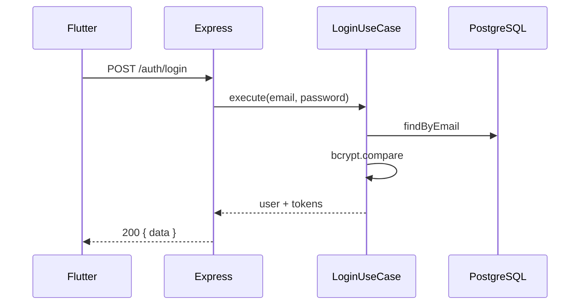
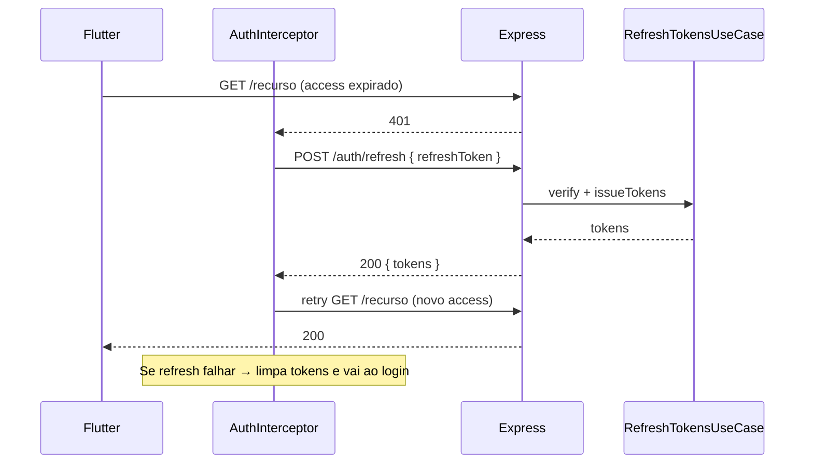
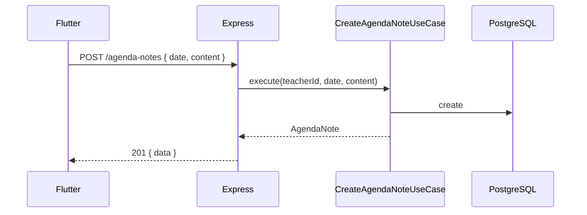
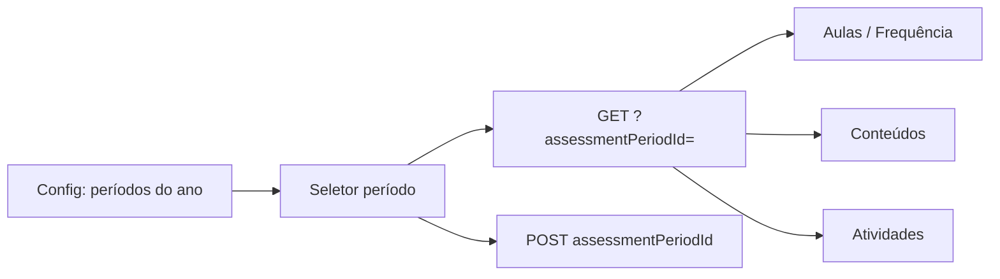
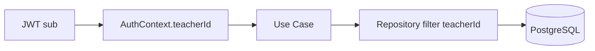
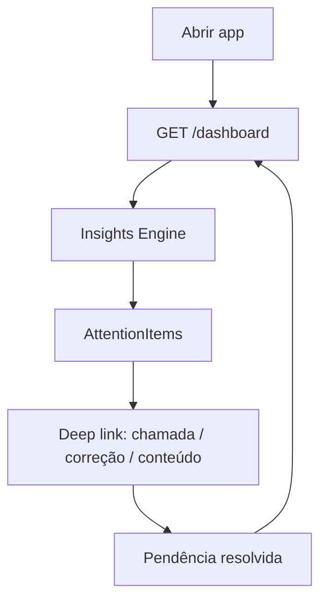
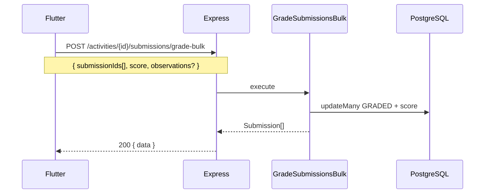
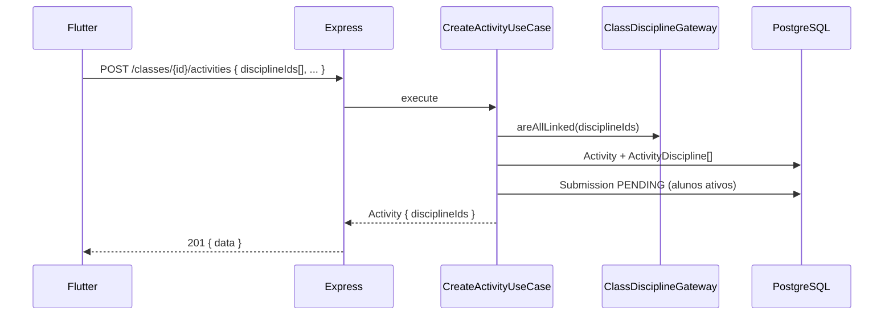

# Fluxos principais

## Autenticação

## Refresh token (renovação silenciosa)

## Agenda (anotações por data)

No app: menu **Agenda** → filtros **Pendentes / Concluídas / Todas**, texto e data →
cada **linha é uma anotação distinta** (várias no mesmo dia). **Nova anotação** cria
sempre um registro novo (data padrão hoje, alterável). Checkbox conclui; exclusão remove só aquela linha.

## Período avaliativo (contexto global)

No AppBar: seletor de **ano letivo** + seletor de **período** (ex.: 1º Trimestre).
Aulas, frequência (via aulas), conteúdos e atividades listam e criam no período efetivo.

## Ownership (todas as features futuras)

## Dashboard (previsto)

## Nota em lote (seleção de alunos)

## Criar atividade (múltiplas disciplinas)

