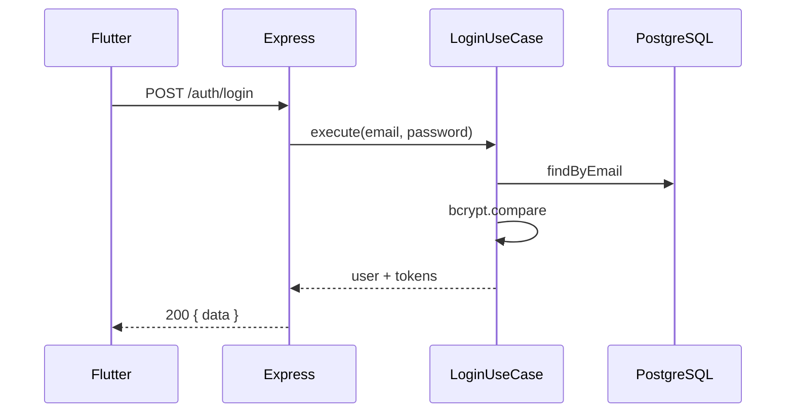
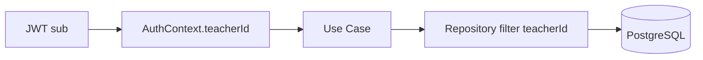
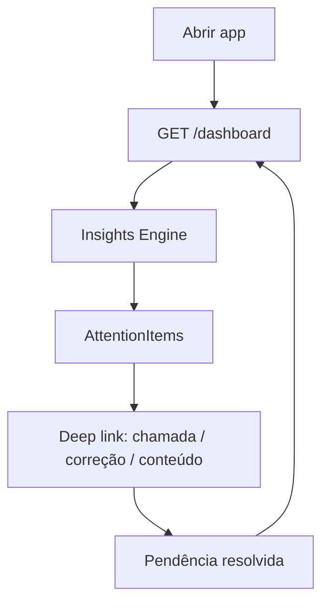

# Fluxos principais

## Autenticação

```mermaid
sequenceDiagram
  participant App as Flutter
  participant API as Express
  participant UC as LoginUseCase
  participant DB as PostgreSQL

  App->>API: POST /auth/login
  API->>UC: execute(email, password)
  UC->>DB: findByEmail
  UC->>UC: bcrypt.compare
  UC-->>API: user + tokens
  API-->>App: 200 { data }
```

## Ownership (todas as features futuras)

```mermaid
flowchart LR
  JWT[JWT sub] --> Ctx[AuthContext.teacherId]
  Ctx --> UC[Use Case]
  UC --> Repo[Repository filter teacherId]
  Repo --> DB[(PostgreSQL)]
```

## Dashboard (previsto)

```mermaid
flowchart TD
  Open[Abrir app] --> Dash[GET /dashboard]
  Dash --> Insights[Insights Engine]
  Insights --> Items[AttentionItems]
  Items --> Action[Deep link: chamada / correção / conteúdo]
  Action --> Done[Pendência resolvida]
  Done --> Dash
```
